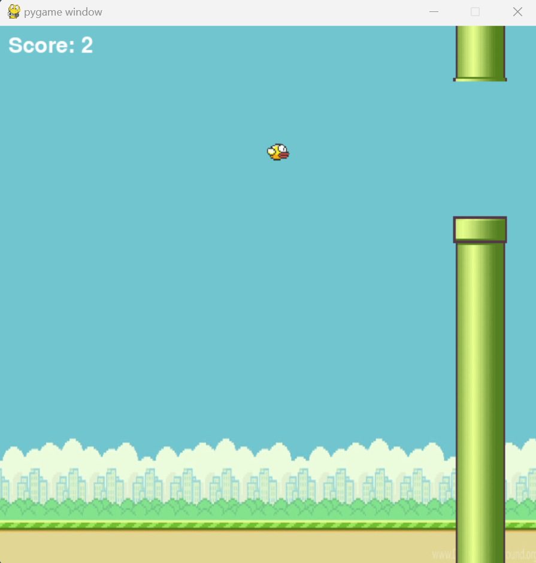
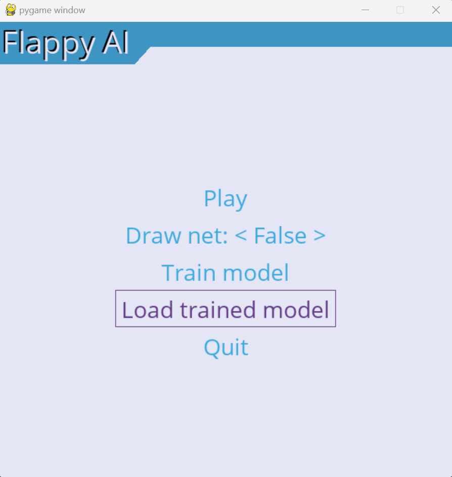
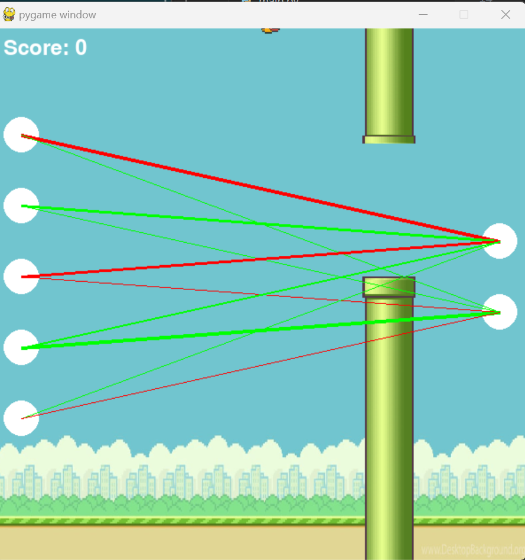

# Flappy Bird AI

An AI-driven Flappy Bird game simulator using `pygame` for visualization and NEAT for training the bird to navigate through the pipes.

  

## Description

The project aims to showcase how NEAT (NeuroEvolution of Augmenting Topologies) can be used to teach a simple bird character to navigate its environment in the classic Flappy Bird game.

## Prerequisites

- Python 3.x


## Installation

1. Clone the repository:
   ```bash
   git clone https://github.com/your-username/flappy-bird-ai.git
   ```

2. Navigate into the project directory:
   ```bash
   cd flappy-bird-ai
   ```

3. Install the required packages:
   ```bash
   pip install -r requirements.txt
   ```

